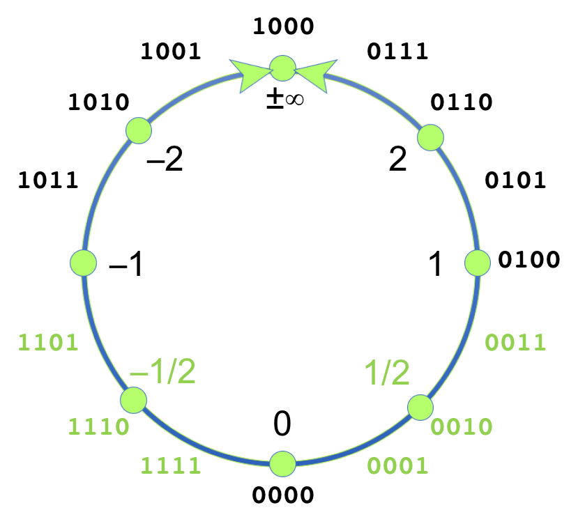
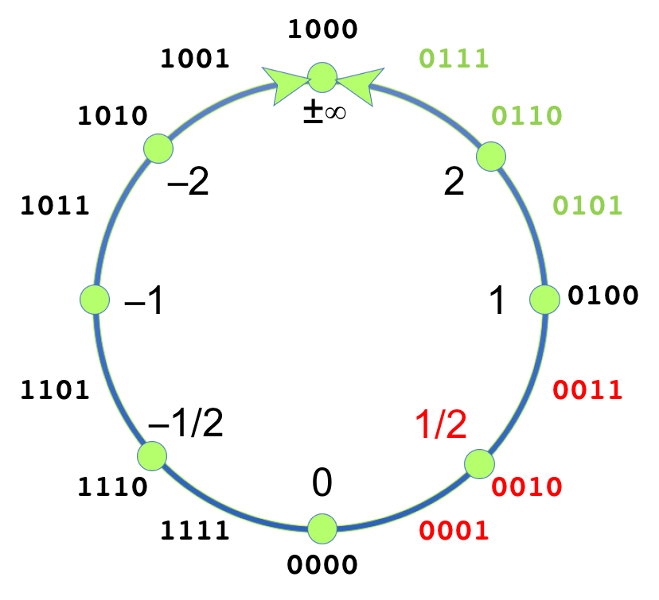

# pypnunum
Gustafson Unum 2.0 written in Python 3.5

See also the C++ version of the same https://github.com/eruffaldi/cppunum2

This is based on elements of Julia version https://github.com/jwmerrill/Pnums.jl

# Unum 2.0 Coolness

The fact that 1/x and -x are visible in the lattice circle, and this also applies to bounds of such numbers (Pbounds)

The following is an example of the 1/x values  the circle

The following the inverse of a bound interval

# Unum 2.0 Implementation Limits

There is a known limit in the scalability of Unum 2.0 for + and * operations needing tables for. In the present implementation we compute the operation among items of the lattice (x +* y) and then convert them into the corresponidng unum.

# Missing

- verification of convert from real of 1/x
- testing of p8 and p8b sets
- sqrt
- exp
- maximum
- storing the op tables
- pbound operations

# Ideas

- map indices of Pnum given set A to indices of set B (e.g. from 16bit to 8bit and viceversa) assuming that the intervals are compatible (subset/superset)

